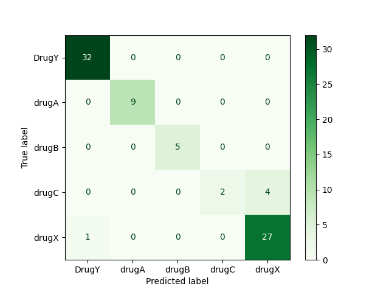

# CICD-ML
This repository is for Machine Learning while the deployment is done using CI/CD.

## Project Description
In this project, we will train our random forest algorithm and create a drug classifier using scikit-learn pipelines. We will use CML to automate the evaluation process following training. Eventually, the online application will be developed and implemented at Hugging Face Hub. 

GitHub actions will be used to automate every step of the process, from training to evaluation. The model on Hugging Face will be updated with the new app, model, and results in just two minutes after you push the code to your GitHub repository.

## Results
| Model                  | Accuracy | F1 Score |
|------------------------|----------|----------|
| RandomForestClassifier | 96.0%    | 94.0%    |

